### 在 Markdown 文件中、使用 Mermaid

只需使用 **三重反引號**（```）括住 Mermaid 語句，即可讓文件呈現圖表、具備視覺化效果。

```markdown
```mermaid

    %%Mermaid code
```

```
### 繪製流程圖

生成一個從左到右排列、A 指向 B、B 指向 C、C 指向的流程圖。

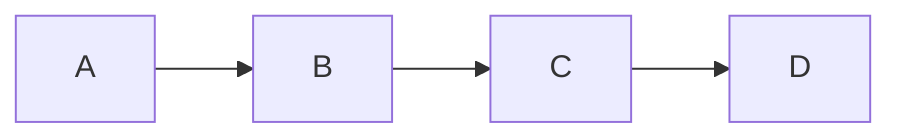

```markdown
graph LR;
    A-->B;
    B-->C;
    C-->D;
```

### 增加標籤與樣式

如果想要增加連結的標籤，可以使用 `|文字|` 來註解。

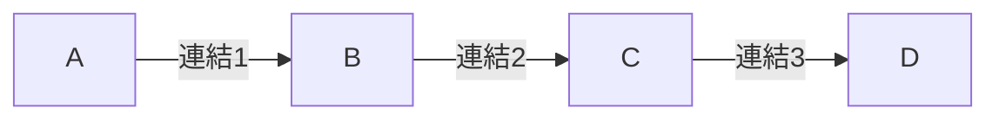

```markdown
graph LR;
    A-->|連結1|B;
    B-->|連結2|C;
    C-->|連結3|D;
```

### 使用不同形狀

可以使用 `style` 設定節點的樣式，圖表可以包含：

- `("文字")` 代表橢圓形
- `{"文字"}` 代表菱形
- `["文字"]` 代表矩形

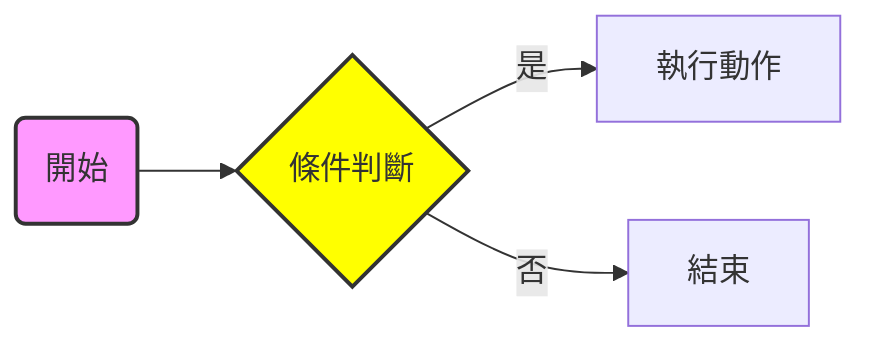

```markdown
graph LR;
style A fill:#f9f,stroke:#333,stroke-width:2px;
style B fill:#ff0,stroke:#333,stroke-width:2px;

    A("開始") --> B{"條件判斷"};
    B -->|是| C["執行動作"];
    B -->|否| D[結束];
```

### 也可由上至下繪製

使用 graph LR;（由左到右）、或 graph TD;（由上到下）來繪製流程圖。

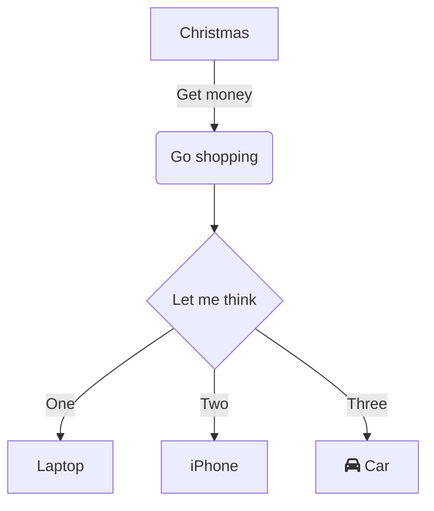

```markdown
flowchart TD
    A[Christmas] -->|Get money| B(Go shopping)
    B --> C{Let me think}
    C -->|One| D[Laptop]
    C -->|Two| E[iPhone]
    C -->|Three| F[fa:fa-car Car]
```

### 序列圖（Sequence Diagram）

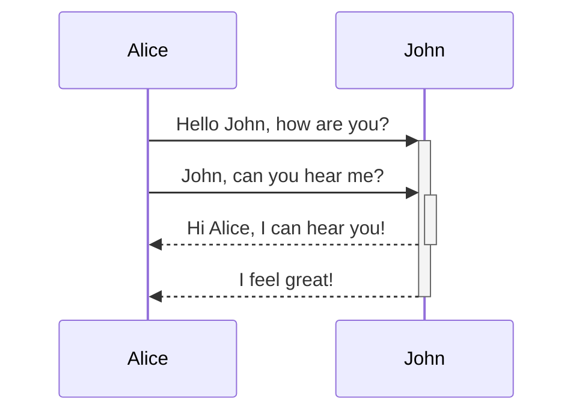

```markdown
sequenceDiagram
    Alice->>+John: Hello John, how are you?
    Alice->>+John: John, can you hear me?
    John-->>-Alice: Hi Alice, I can hear you!
    John-->>-Alice: I feel great!
```

### 甘特圖（Gantt Chart）

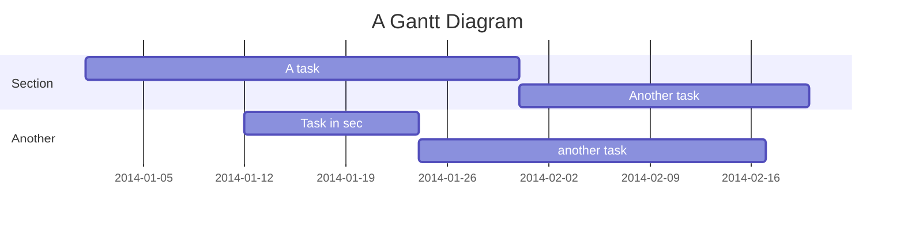

```markdown
gantt
    title A Gantt Diagram
    dateFormat  YYYY-MM-DD
    section Section
    A task           :a1, 2014-01-01, 30d
    Another task     :after a1  , 20d
    section Another
    Task in sec      :2014-01-12  , 12d
    another task      : 24d
```

### 類別圖（Class Diagram）

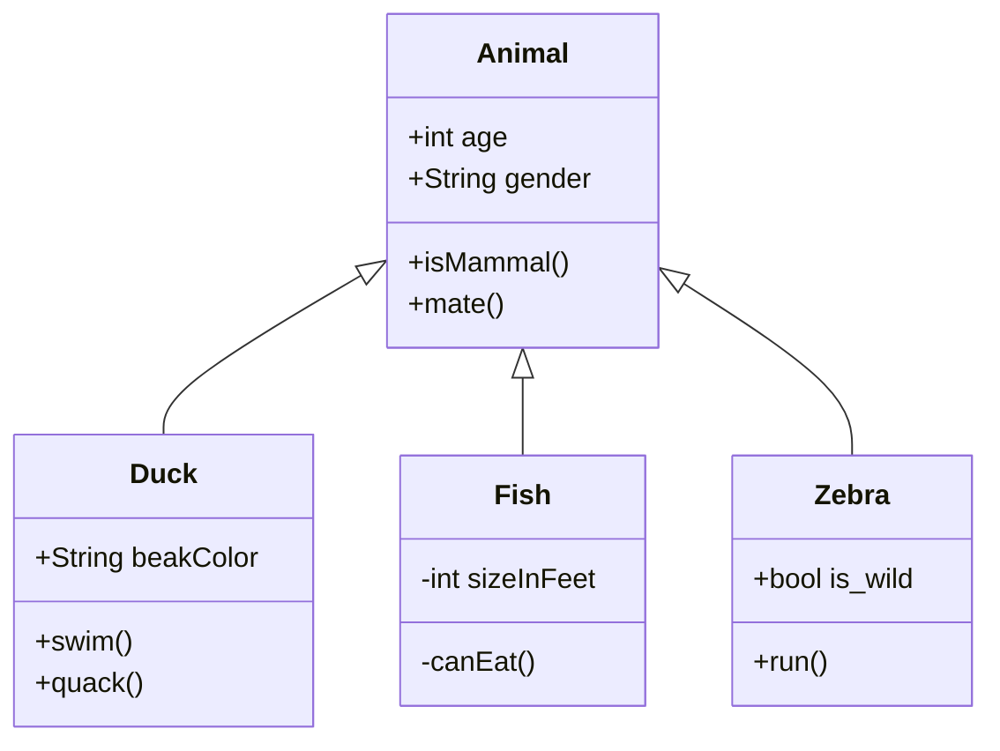

```markdown
classDiagram
    Animal <|-- Duck
    Animal <|-- Fish
    Animal <|-- Zebra
    Animal : +int age
    Animal : +String gender
    Animal: +isMammal()
    Animal: +mate()
    class Duck{
      +String beakColor
      +swim()
      +quack()
    }
    class Fish{
      -int sizeInFeet
      -canEat()
    }
    class Zebra{
      +bool is_wild
      +run()
    }
```

### 狀態圖（State Diagram）

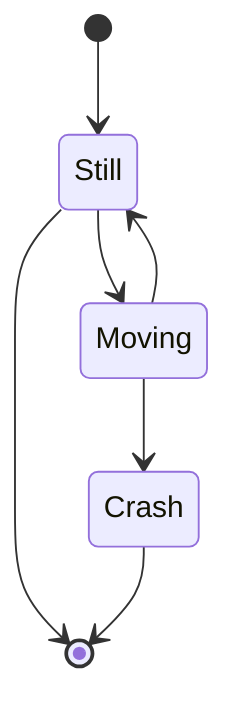

```markdown
stateDiagram-v2
    [*] --> Still
    Still --> [*]
    Still --> Moving
    Moving --> Still
    Moving --> Crash
    Crash --> [*]
```

### 餅圖（Pie Chart）

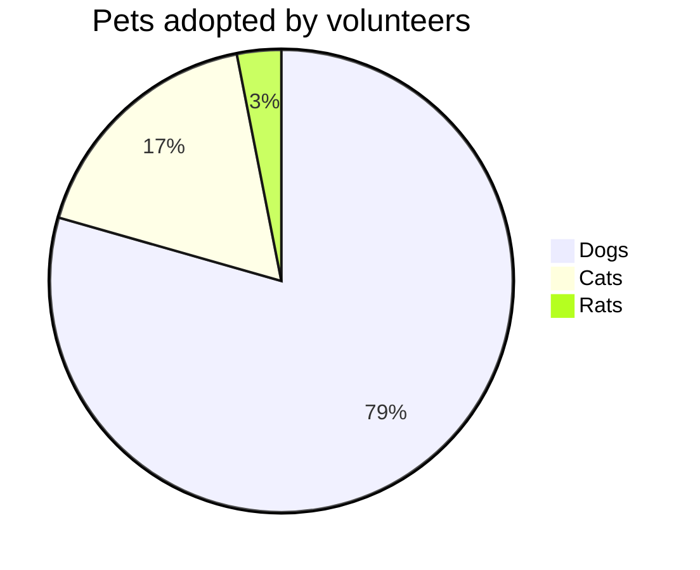

```markdown
pie title Pets adopted by volunteers
    "Dogs" : 386
    "Cats" : 85
    "Rats" : 15
```

### ER 圖（ER Chart）

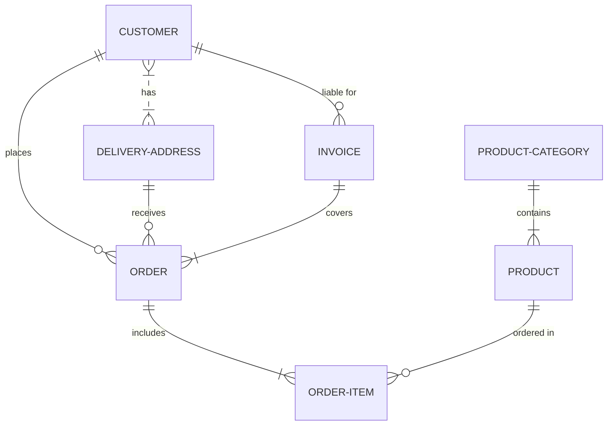

```markdown
erDiagram
    CUSTOMER }|..|{ DELIVERY-ADDRESS : has
    CUSTOMER ||--o{ ORDER : places
    CUSTOMER ||--o{ INVOICE : "liable for"
    DELIVERY-ADDRESS ||--o{ ORDER : receives
    INVOICE ||--|{ ORDER : covers
    ORDER ||--|{ ORDER-ITEM : includes
    PRODUCT-CATEGORY ||--|{ PRODUCT : contains
    PRODUCT ||--o{ ORDER-ITEM : "ordered in"
```

## Flowchart


## Sequence diagram

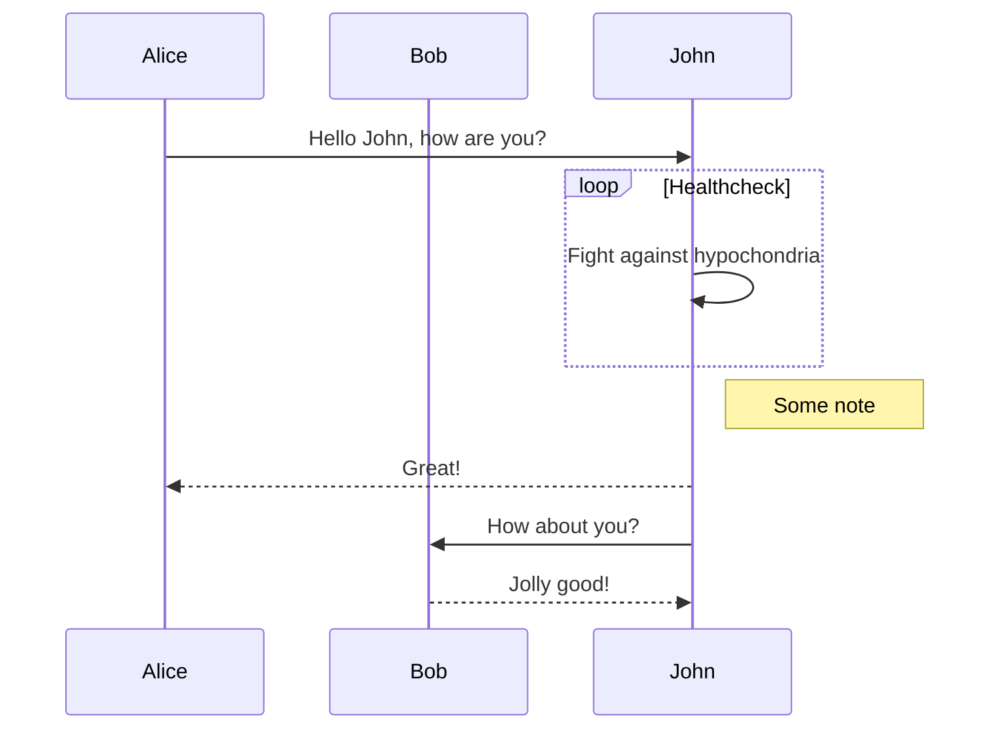

## Gantt diagram

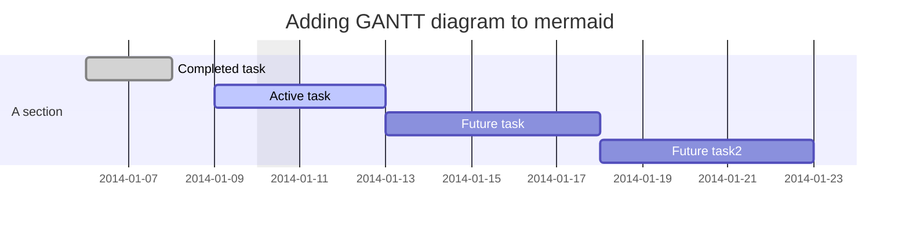

## Class diagram (experimental)

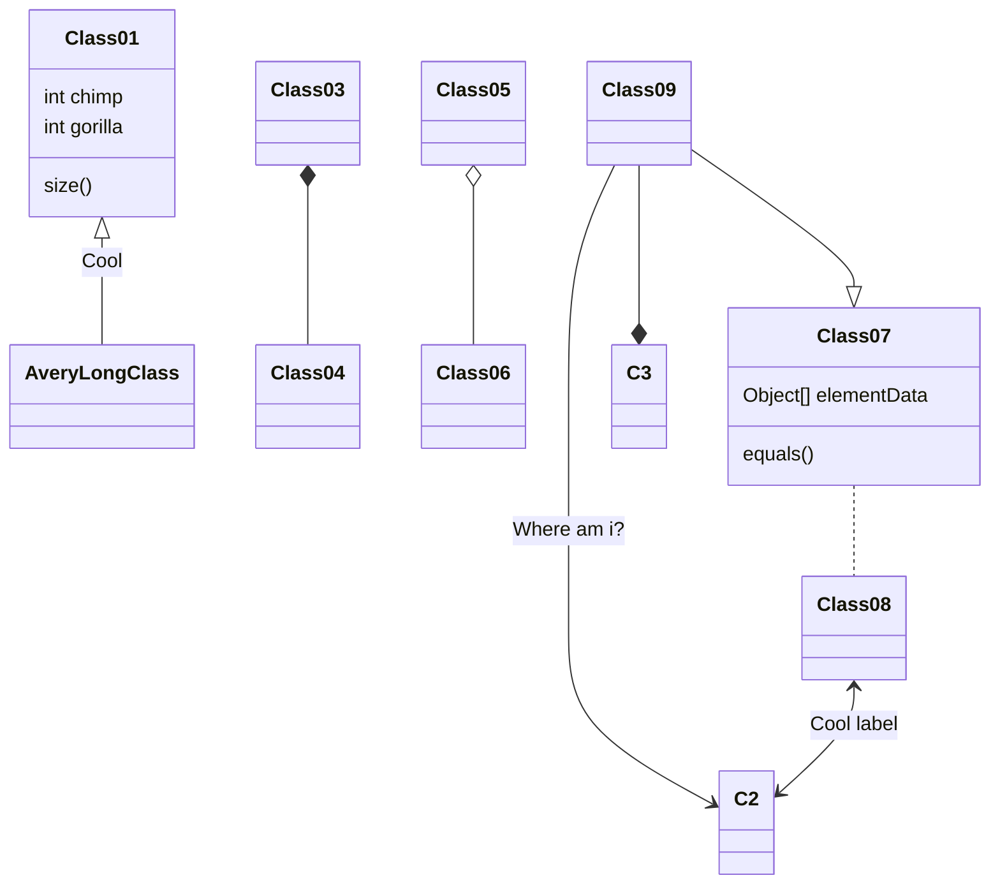

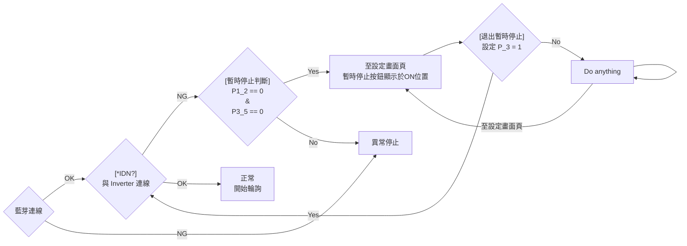

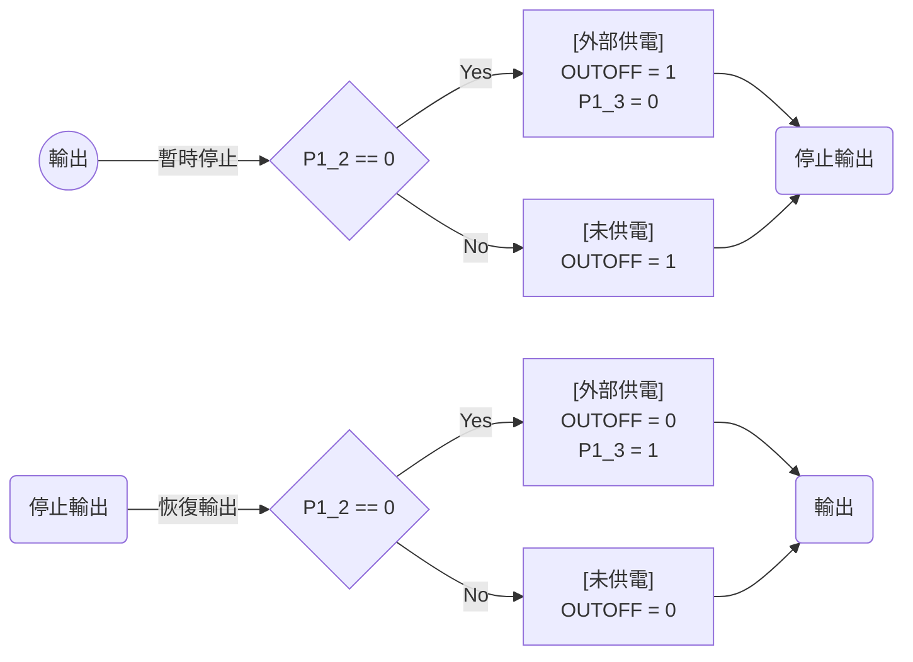


===

# Hello World

Follow this Hello World exercise to learn GitHub's pull request workflow.

## Introduction

This tutorial teaches you GitHub essentials like repositories, branches, commits, and pull requests. You'll create your own Hello World repository and learn GitHub's pull request workflow, a popular way to create and review code.
In this quickstart guide, you will:

* Create and use a repository.
* Start and manage a new branch.
* Make changes to a file and push them to GitHub as commits.
* Open and merge a pull request.
  
  ### Prerequisites
* You must have a GitHub account. For more information, see [Creating an account on GitHub](/en/get-started/start-your-journey/creating-an-account-on-github).
* You don't need to know how to code, use the command line, or install Git (the version control software that GitHub is built on).
  
  ## Step 1: Create a repository
  
  The first thing we'll do is create a repository. You can think of a repository as a folder that contains related items, such as files, images, videos, or even other folders. A repository usually groups together items that belong to the same "project" or thing you're working on.
  Often, repositories include a README file, a file with information about your project. README files are written in Markdown, which is an easy-to-read, easy-to-write language for formatting plain text. We'll learn more about Markdown in the next tutorial, [Setting up your profile](/en/get-started/start-your-journey/setting-up-your-profile).
  GitHub lets you add a README file at the same time you create your new repository. GitHub also offers other common options such as a license file, but you do not have to select any of them now.
  Your `hello-world` repository can be a place where you store ideas, resources, or even share and discuss things with others.
1. In the upper-right corner of any page, select <svg version="1.1" width="16" height="16" viewBox="0 0 16 16" class="octicon octicon-plus" aria-label="Create something new" role="img"><path d="M7.75 2a.75.75 0 0 1 .75.75V7h4.25a.75.75 0 0 1 0 1.5H8.5v4.25a.75.75 0 0 1-1.5 0V8.5H2.75a.75.75 0 0 1 0-1.5H7V2.75A.75.75 0 0 1 7.75 2Z"></path></svg>, then click **New repository**.
   
2. In the "Repository name" box, type `hello-world`.
3. In the "Description" box, type a short description. For example, type "This repository is for practicing the GitHub Flow."
4. Select whether your repository will be **Public** or **Private**.
5. Select **Add a README file**.
6. Click **Create repository**.
   
   ## Step 2: Create a branch
   
   Branching lets you have different versions of a repository at one time.
   By default, your repository has one branch named `main` that is considered to be the definitive branch. You can create additional branches off of `main` in your repository.
   Branching is helpful when you want to add new features to a project without changing the main source of code. The work done on different branches will not show up on the main branch until you merge it, which we will cover later in this guide. You can use branches to experiment and make edits before committing them to `main`.
   When you create a branch off the `main` branch, you're making a copy, or snapshot, of `main` as it was at that point in time. If someone else made changes to the `main` branch while you were working on your branch, you could pull in those updates.
   This diagram shows:
* The `main` branch
* A new branch called `feature`
* The journey that `feature` takes through stages for "Commit changes," "Submit pull request," and "Discuss proposed changes" before it's merged into `main`
  
  
  ### Creating a branch
1. Click the **Code** tab of your `hello-world` repository.
2. Above the file list, click the dropdown menu that says **main**.
   
3. Type a branch name, `readme-edits`, into the text box.
4. Click **Create branch: readme-edits from main**.
   
   Now you have two branches, `main` and `readme-edits`. Right now, they look exactly the same. Next you'll add changes to the new `readme-edits` branch.
   
   ## Step 3: Make and commit changes
   
   When you created a new branch in the previous step, GitHub brought you to the code page for your new `readme-edits` branch, which is a copy of `main`.
   You can make and save changes to the files in your repository. On GitHub, saved changes are called commits. Each commit has an associated commit message, which is a description explaining why a particular change was made. Commit messages capture the history of your changes so that other contributors can understand what you’ve done and why.
5. Under the `readme-edits` branch you created, click the `README.md` file.
6. To edit the file, click <svg version="1.1" width="16" height="16" viewBox="0 0 16 16" class="octicon octicon-pencil" aria-label="Edit file" role="img"><path d="M11.013 1.427a1.75 1.75 0 0 1 2.474 0l1.086 1.086a1.75 1.75 0 0 1 0 2.474l-8.61 8.61c-.21.21-.47.364-.756.445l-3.251.93a.75.75 0 0 1-.927-.928l.929-3.25c.081-.286.235-.547.445-.758l8.61-8.61Zm.176 4.823L9.75 4.81l-6.286 6.287a.253.253 0 0 0-.064.108l-.558 1.953 1.953-.558a.253.253 0 0 0 .108-.064Zm1.238-3.763a.25.25 0 0 0-.354 0L10.811 3.75l1.439 1.44 1.263-1.263a.25.25 0 0 0 0-.354Z"></path></svg>.
7. In the editor, write a bit about yourself.
8. Click **Commit changes**.
9. In the "Commit changes" box, write a commit message that describes your changes.
10. Click **Commit changes**.
    These changes will be made only to the README file on your `readme-edits` branch, so now this branch contains content that's different from `main`.
    
    ## Step 4: Open a pull request
    
    Now that you have changes in a branch off of `main`, you can open a pull request.
    Pull requests are the heart of collaboration on GitHub. When you open a pull request, you're proposing your changes and requesting that someone review and pull in your contribution and merge them into their branch. Pull requests show diffs, or differences, of the content from both branches. The changes, additions, and subtractions are shown in different colors.
    As soon as you make a commit, you can open a pull request and start a discussion, even before the code is finished.
    In this step, you'll open a pull request in your own repository and then merge it yourself. It's a great way to practice the GitHub flow before working on larger projects.
11. Click the **Pull requests** tab of your `hello-world` repository.
12. Click **New pull request**.
13. In the **Example Comparisons** box, select the branch you made, `readme-edits`, to compare with `main` (the original).
14. Look over your changes in the diffs on the Compare page, make sure they're what you want to submit.
    
15. Click **Create pull request**.
16. Give your pull request a title and write a brief description of your changes. You can include emojis and drag and drop images and gifs.
17. Click **Create pull request**.
    
    ### Reviewing a pull request
    
    When you start collaborating with others, this is the time you'd ask for their review. This allows your collaborators to comment on, or propose changes to, your pull request before you merge the changes into the `main` branch.
    We won't cover reviewing pull requests in this tutorial, but if you're interested in learning more, see [About pull request reviews](/en/pull-requests/collaborating-with-pull-requests/reviewing-changes-in-pull-requests/about-pull-request-reviews). Alternatively, try the [GitHub Skills](https://skills.github.com/) "Reviewing pull requests" course.
    
    ## Step 5: Merge your pull request
    
    In this final step, you will merge your `readme-edits` branch into the `main` branch. After you merge your pull request, the changes on your `readme-edits` branch will be incorporated into `main`.
    Sometimes, a pull request may introduce changes to code that conflict with the existing code on `main`. If there are any conflicts, GitHub will alert you about the conflicting code and prevent merging until the conflicts are resolved. You can make a commit that resolves the conflicts or use comments in the pull request to discuss the conflicts with your team members.
    In this walk-through, you should not have any conflicts, so you are ready to merge your branch into the main branch.
18. At the bottom of the pull request, click **Merge pull request** to merge the changes into `main`.
19. Click **Confirm merge**. You will receive a message that the request was successfully merged and the request was closed.
20. Click **Delete branch**. Now that your pull request is merged and your changes are on `main`, you can safely delete the `readme-edits` branch. If you want to make more changes to your project, you can always create a new branch and repeat this process.
21. Click back to the **Code** tab of your `hello-world` repository to see your published changes on `main`.
    
    ## Conclusion
    
    By completing this tutorial, you've learned to create a project and make a pull request on GitHub.
    As part of that, we've learned how to:
* Create a repository.
* Start and manage a new branch.
* Change a file and commit those changes to GitHub.
* Open and merge a pull request.
  
  ## Next steps
* Take a look at your GitHub profile and you'll see your work reflected on your contribution graph.
* If you want to practice the skills you've learned in this tutorial again, try the [GitHub Skills](https://skills.github.com/) "Introduction to GitHub" course.
* In the next tutorial, [Setting up your profile](/en/get-started/start-your-journey/setting-up-your-profile), you'll learn how to personalize your profile and you'll also learn some basic Markdown syntax for writing on GitHub.
  
  ## Further reading
* [GitHub flow](/en/get-started/using-github/github-flow)
